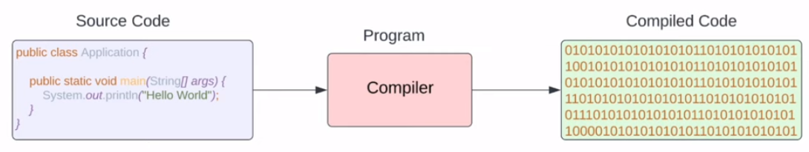

## В состав Computer Science любого языка программирования входят:

## Языки программирования и области их применения

Языков программирования существует большое количество, 
потому что каждый из них занимает определенную нишу.

Не существует универсального ЯП, который можно было бы использовать для всего.

Области применения языков программирования

## Компиляторы

Файлы с исходным кодом читаются людьми, но их содержание непонятно 
компьютеру. 
Поэтому существуют __компиляторы__.

__Компиляторы__ — это программы, которые тоже написаны на одном из языков 
программирования, чтобы преобразовать один тип кода в другой.

Скомпилированный код отличается в зависимости от операционной системы:

Таким образом, под каждую ОС или новую версию процессора придется 
перекомпилировать исходный код, что очень неудобно.

В случае Java решением этой проблемы стало создание JVM (Java Virtual 
Machine) - программа, которая интерпретирует __байт-код__ (*class) в 
машинный код.

Каждая из JVM, установленная на соответствующей платформе, знает как 
преобразовывать байт-код в работоспособный машинный код, характерный 
для данной конкретной платформы. Именно это позволило не 
перекомпилировать код множество раз.

