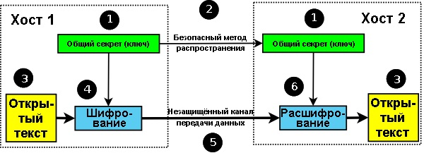
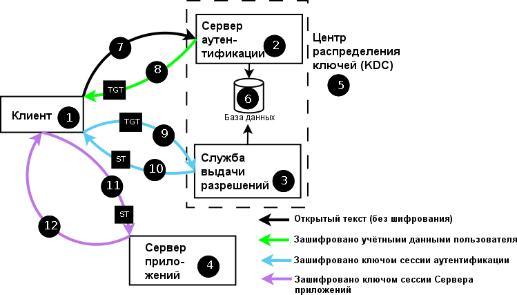
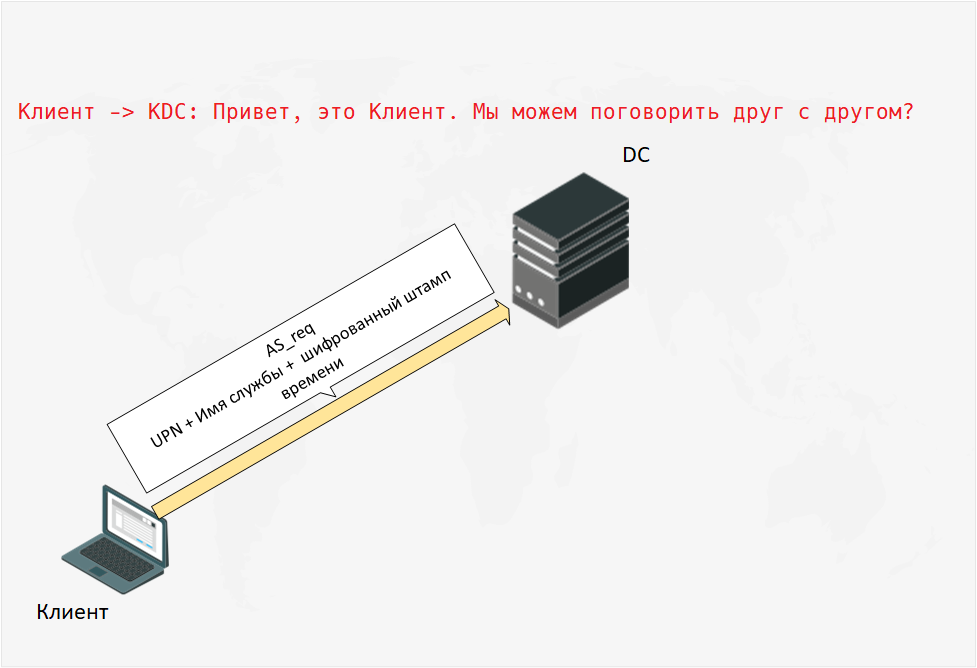
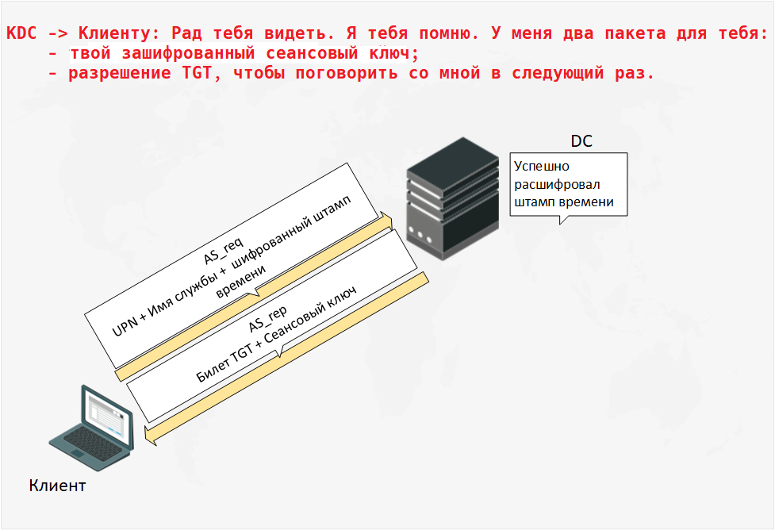
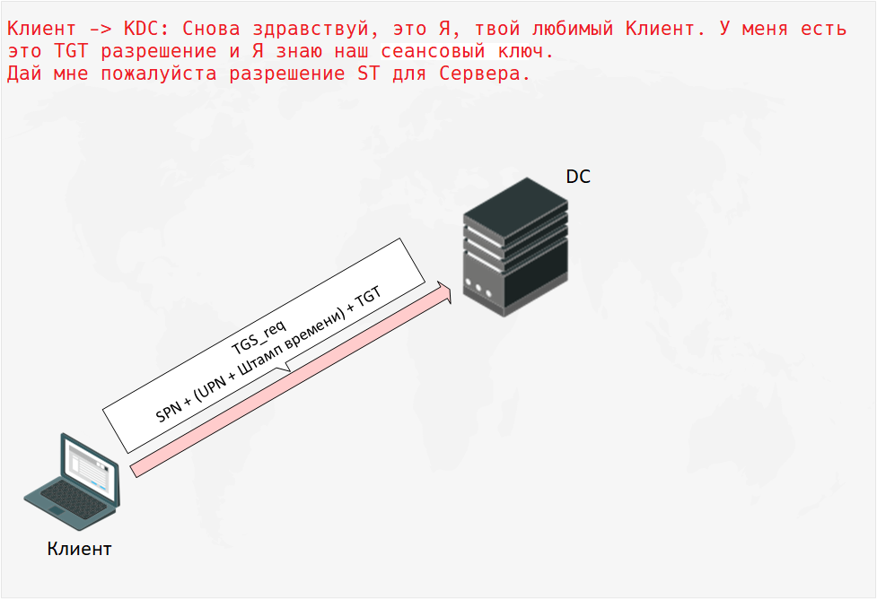
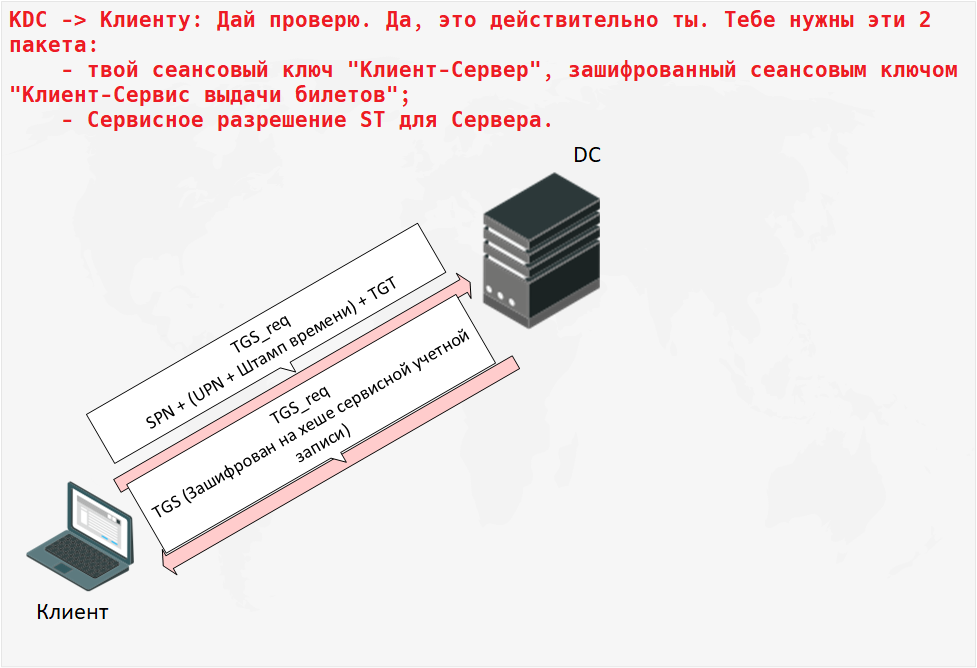

# Kerberos-аутентификация

— сетевой [протокол аутентификации][01], разработанный в MIT в
конце 80-х и позволяющий передавать
данные через незащищенные сети для безопасной идентификации.
Ориентирован в первую очередь на клиент-серверную модель и обеспечивает
взаимную аутентификацию — оба пользователя через сервер подтверждают
личности друг друга.

В первую очередь является протоколом, а не конкретной системой
аутентификации. Его реализации используются в различных ОС, в т.ч. и в
Windows, как метод аутентификации пользователей в домене.

Kerberos предоставляет как сетевую **аутентификацию**, так и безопасный
метод, посредством которого может быть проведена **авторизация** без
необходимости повторного ввода пароля или предоставления других
**удостоверяющих данных**. Поэтому он используется для обеспечения того,
что обычно называется **Технологией единого входа (Single Sign-on, SSO)**.

Kerberos не делает никаких предположений о защищённости той сети, поверх
которой он работает (по факту, он просто ей не доверяет). Однако, он
предполагает, что хосты приложений и особенно хост, на котором работает
Центр распределения ключей, являются защищёнными.

## Основные роли Kerberos

- Центр распределения ключей (KDC, Key Distribution Center)
- Client
- Server/Service

## Особенности Kerberos:

1. Пароли или иные удостоверяющие данные **никогда не пересылаются по сети
   **.
   Подразумевается, что сетевой трафик может быть прослушан, может
   произойти подмена сообщения или другая атака. Вместо них
   используются билеты (Tickets).
2. Выдвигается обязательное требование, что информация о
   паролях/удостоверяющих данных хранится в единственном защищённом
   месте (Центре распределения ключей Kerberos). Поэтому удостоверяющие
   данные никогда не сохраняются на том хосте, который пользователь
   использует для входа/логина. После того, как произошёл первоначальный
   обмен в рамках
   **аутентификации**, этот хост должен забыть сведения о пароле.
3. Хосты/серверы приложений должны быть в состоянии подтвердить свою
   идентификационную сущность любому, кто запрашивает подобные
   доказательства.
4. Все коммуникации между аутентифицированными пользователями (клиентами) и
   сервисами приложений должны иметь возможность быть зашифрованными. С
   этой целью поддерживаются и могут применяться различные алгоритмы
   шифрования (все **симметричные**).
5. Поддерживает делегирование учетных данных (т.н. олицетворение, т.е.
   может сказать серверу, что он может передать свою идентичность другому
   серверу, поэтому какой-то средний уровень, какой-то шлюз может
   олицетворять клиента).
6. Серверу не нужно общаться с KDC для аутентификации клиентов

## Узкие места Kerberos

- Время на всех 3 ролях должно быть синхронизировано, это необходимо для
  корректной работы Kerberos.
- KDC — это единая точка отказа всей системы.
- Клиенты Kerberos ищут свои сервера по доменным именам, поэтому необходимо
  настроить DNS и убедиться, что имена серверов успешно разрешаются, т.к.
  обработка имен хостов службы подвержена ошибкам

## Основные термины

### Аутентификация (authentication)

— процесс или процедуры, используемые для проверки того, что данные или
информация, заявленные как поступившие из какого-то источника (от какого-то
человека), могли поступить только из этого источника (от этого человека).
Не следует путать с авторизацией.

### Авторизация (authorization)

— после того, как пользователи прошли аутентификацию, они могут быть
авторизованы на получение или запрет доступа к определённым
системным/сетевым ресурсам, таким как файлы, приложения, либо возможность
отправки электронной почты, выхода в Интернет и т.п. Процесс аутентификации
обычно обеспечивает доступ к набору записей в базе данных по защите
информации, которые содержат данные по доступу и/или дополнительные данные,
основанные на принадлежности учётной записи к одной или нескольким группам.

Термин "**привилегия**" иногда используется как синоним авторизации. Так,
пользователь может иметь достаточно привилегий для доступа к ресурсу X, но
не к ресурсу Y, или, иными словами, он авторизован на доступ к X, но не
авторизован на доступ к Y.

### Удостоверяющие данные (Credentials)

— пароль и иные формы, такие как аппаратный токен или биометрические
данные). Удостоверяющие данные являются одним из способов доказать, что
Вы именно тот, за кого себя выдаёте. Так как Вы должны быть
единственным человеком (или, в некоторых случаях, группой лиц)
кто знает или имеет доступ к Вашим удостоверяющим данным, то когда Вы
предоставляете их в системе или в сети и они совпадают с теми, которые
ранее были безопасным способом занесены и сохранены в некоторую форму базы
данных по защите информации, это доказывает, что Вы именно тот, за кого
себя выдаёте. После выполнения неких форм обмена данными, которые будут
включать в себя предоставление Ваших удостоверяющих данных (например, набор
пароля), Вы становитесь **аутентифицированы**. Как правило, после
аутентификации Вам ещё нужно быть **авторизованным** для доступа к ресурсам
или информации.

### Симметричные алгоритмы шифрования

— также известные как системы с одним ключом (single-key) или с общим
секретом (shared-secret) или системы с закрытым ключом (private-key).
Используют единственный ключ (или набор ключей) для шифрования и
расшифровывания данных.

Единственный ключ (общий секрет) должен быть безопасным образом
распространён между сторонами, которые будут его использовать, перед
началом самих безопасных коммуникаций.

У систем с общим секретом существует как минимум два узких места:

- Во-первых, ключ должен быть распространён безопасным способом с помощью
  процесса, называемого управлением ключами, который сам по себе
  нетривиален.
- Во-вторых, ответственность за безопасность уже распространённого ключа
  лежит на всех сторонах коммуникации: "Самому себе я доверяю, но могу ли я
  доверять всем остальным сторонам, что они не допустили огласки ключа?".

Если ключ, являющийся общим секретом, скомпрометирован на любой из сторон,
то он скомпрометирован для всех использующих его сторон. Симметричные
алгоритмы используют значительно меньше вычислительных ресурсов, нежели их
асимметричные коллеги. Как правило, они являются единственным приемлемым
способом шифрования объемных потоков данных.

Примеры распространённых симметричных алгоритмов шифрования:

- DES (Data Encryption Standard, он же Data Encryption Algorithm (DEA))
- Triple DES (TDES, он же TDEA (Triple DEA))
- AES (Advanced Encryption Standard)
- IDEA (International Data Encryption Algorithm)
- RC4 (Rivest Cipher 4)

Типичные размеры ключей:

- 64 бита
- 128 бит
- 192 бита
- 256 бит

### Центр распределения ключей (KDC, Key Distribution Center)

При использовании Kerberos пользователи никогда не аутентифицируют себя
**напрямую** в различных необходимых им службах. Вместо этого KDC
функционирует как **доверенная сторонняя служба проверки подлинности**.
 Компонентами KDC являются:

- сервер аутентификации (AS, Authentication Server);
- служба выдачи разрешений (TGS, Ticket-Granting Service);

### Разрешение (Ticket)

— частично зашифрованная структура данных, содержимое которой известно
только издателю этого разрешения, и какой-либо стороне или сторонам, к
которым это разрешение имеет отношение.

В открытом виде разрешение содержит:

- Domain Name (Realm) — наименование области действия
- Service Principal Name (SPN) — имя **принципала сервиса**

В зашифрованном виде разрешение содержит:

- User Principal Name (UPN) — имя **принципала пользователя**
- Copy of the Session Key — случайным образом сгенерированный
  уникальный ключ сессии;
- Time To Live (TTL) — времени жизни ключа (по умолчанию - 10 часов)
- флаги и дополнительная информация

Промежуточные хосты, такие как клиентский хост, рассматривают эти
разрешения как **неразбираемый набор бит** и просто передают их на конечный
пункт назначения.

В Kerberos разрешения могут быть 2 видов:

- **Билеты** (**разрешения на получения разрешения**) (Ticket Granting
  Tickets, TGT) — выдаются сервером аутентификации.
- **Сервисные разрешения** (Service Tickets, ST) — выдаются службой выдачи
  разрешений (Ticket Granting Service, TGS).

### Разрешение на получение разрешения (TGT-билет, Ticket-Granting Ticket)

— временные данные, выдаваемые клиенту для аутентификации на сервере,
на котором располагается необходимая служба. По сути является
доказательством успешно пройденной аутентификации. Когда пользователю
требуется доступ к ресурсам, ему не нужно повторно аутентифицироваться,
клиент просто отправляет TGT, чтобы доказать, что он уже недавно это
сделал.

Все TGT билеты KDC шифрует с помощью пароля для специальной учетной
записи `KRBTG`. Секретный ключ сервиса `KRBTGT` по умолчанию никогда не
меняется, только за исключением случаев, когда контроллер домена (DC) был
обновлён.

### Сервисное разрешение (Service Tickets, ST)

позволяет пользователю получить доступ к требуемому Сервису приложений
(Application Service). ST также называют сервисным билетом, который
используется для получения доступа к требуемым доменным ресурсам. По
умолчанию действителен в течение 10 часов, не может быть обновлен, а
должен каждый раз запрашиваться повторно, в отличие от TGT.

### Сервис выдачи билетов (TGS, Ticket-Granting Service)

Действует как контрольная точка и выдает сервисные разрешения после его
аутентификации.

### Сеансовый ключ

— ключ, отправляемый Сервером Клиенту. Шифруется с использованием хеша
пароля учетной записи пользователя. Необходим для шифрования следующего
сообщения Клиента к Серверу.

### Клиент (client)

— некая сущность в сети (пользователь, хост или сервис), которая может
получить билет от Kerberos.

### Принципал (principal)

— это уникальная строка, полностью идентифицирующая пользователя службы
Kerberos, для которого разрешается аутентификация в Kerberos. Он
имеет форму `thing@REALM`.

Принципал может быть:

- именем сервиса, выполняющегося на хосте (мы будем называть его
  **принципалом сервиса** (**Service-Principal**))
- именем пользователя (мы будем называть его принципалом пользователя
  (**User-Principal**)).

Принципалы формируют индексное поле для информации об объекте,
хранящейся в базе данных безопасности Kerberos (в Центре распределения
ключей или KDC).

Форматы принципалов для **пользователей** и **сервисов** различаются:

- имя **принципала пользователя** — это приблизительный эквивалент имени
  пользователя или имени учётной записи.
   Оно имеет форму `principal-name[/instance-name]@REALM` (где часть
  /instance-name является опциональной). Например, если имя пользователя в
  принципале пользователя — `alice`, а Realm — `joe`, то полный принципал
  будет `alice@joe`. Расширение `instance-name` позволяет любому
  пользователю иметь **более одного принципала**. Так, если `alice`
  является
  администратором области Realm `joe`, имя её принципала
  будет `alice/admin@joe`, и у этого принципала будут другие
  права (и удостоверяющие данные).

- если речь идёт о **принципале сервиса**, то форма имени принципала
  становится
  `service-name/QDN@REALM`, где
    - QDN — это доменное имя хоста (без точки в
      конце, как того требует FQDN), на котором работает сервис
    - service-name — это специфичная для приложения строка,
      идентифицирующая сервис на этом хосте. Некоторые типы сервисов
      используют ключевое слово host. Так, для сервиса ftp, работающего на
      хосте с именем fileserver.example.com в области Realm @EXAMPLE.COM,
      имя принципала сервиса
      будет `ftp/fileserver.example.com@EXAMPLE.COM`.

### Область действия (Realm)

— совокупность пользователей и серверов приложений, которые охватывает
(или имеет о них информацию) Центр распределения ключей (KDC). Так, для
того чтобы пользователь подсоединился (или вошёл) в Realm, у Сервера
аутентификации (Authentication Server) этой области Realm должны быть
сведения об **удостоверяющих данных** этого пользователя (и другая
информация о нём), хранящиеся в защищённой базе данных безопасности того
или иного вида (форма хранения не определяется в RFC).
 В терминологии Microsoft это будет называться Доменом (Domain).
Области Realm могут доверять другим Realm, в этом случае доверяющие
друг другу области должны быть **взаимно аутентифицированными**
(**Cross-Authenticated**).

Имя Realm **регистрозависимо**, обычно пишется в верхнем регистре
и совпадает с именем домена.
Форма имени — **...@REALM**. Например, если Realm называется JOE, то его
**Realm-имя** будет **@JOE** (что отличается от Realm-имени **@joe**), а
если Realm называется **EXAMPLE.COM**, то его Realm-имя будет
**@EXAMPLE.COM**.

(Примечание:
Согласно текущей рекомендации ([раздел 6.1 RFC 4120][02]) в качестве имени
REALM следует использовать доменное имя, которое часто преобразуется в
верхний регистр.)

Несмотря на то, что последняя форма может напоминать
адрес электронной почты, никакого отношения к электронной почте она не
имеет. Если буквы большие, это наверняка REALM, а не почта.

### Штамп времени до аутентификации (Pre-Authentication Timestamp)

— шифруется с помощью хеша, созданного на основе пароля от учетной
записи (`AS_req`) или с помощью сеансового ключа (`TSG_req`)

## Схема общения между Клиентом и Сервером

представляется в виде потока сообщений:

1. Клиент аутентифицируется в KDC и в случае успеха получает TGT.
    1. Пользователь выполняет вход в систему на клиентском хосте (1),
       предоставляя при этом **принципал пользователя** и требуемый
       **принципал сервиса**, которые посылаются в виде `AS_REQ` (
       Authentication Service Request) (7) Серверу аутентификации (
       Authentication Server, AS) (2) Центра распределения ключей (KDC)
       Kerberos (5) открытым текстом (без какого-либо шифрования).
        В качестве KDC в инфраструктуре MS Active Directory
       выступают контроллеры доменов.

       
    
        В самом `AS_REQ` фигурируют атрибуты:
        - User Principal Name (UPN) — имя **принципала пользователя**
        - Service Principal Name (SPN) — имя **принципала сервиса**,
          к которому пользователь хочет подключиться (как правило,
          принципала Службы выдачи разрешений (TGS), имеющего название
          `krbtgt/REALM@REALM`)
        - опциональный список IP-адресов, которые пользователь хочет
          использовать
        - опциональное время жизни для этого входа в систему
        - метку nonce (случайное число), используемую как для идентификации
          ответов, так и для снижения риска подвергнуться атакам
          воспроизведения (replay attacks)
        - Pre-Authentication Timestamp

    2. После проверки наличия **принципала пользователя** и **принципала
       сервиса** в базе данных безопасности `NTDS.dit`(6), расшифровки и
       сравнения временных меток Сервер аутентификации (2)
       посылает Клиенту в виде ответного сообщения `AS_REP` (Authentication
       Service Reply) (8).

        При получении этого сообщения, клиент (1) запрашивает
       **удостоверяющие данные пользователя**, и, если он сможет
       расшифровать сообщение (8) с
       помощью представленных удостоверяющих данных, то эти удостоверяющие
       данные считаются корректными и пользователь становится
       **аутентифицированным**. После этого сведения об удостоверяющих
       данных пользователя могут быть сразу же забыты. Хотя системы,
       проводящие аутентификацию, могут запросить ввести удостоверяющие
       данные в тоже самое время, когда вводится имя учётной записи
       пользователя, на самом деле это не требуется, поскольку протокол
       Kerberos позволяет отложить запрос удостоверяющих данных вплоть до
       этого шага, чтобы минимизировать возможные негативные последствия
       при использовании небезопасной хост-системы или ПЭВМ.

        Если зашифрованный штамп времени отличается от текущего в момент
       расшифровки **более, чем на 5 минут** (значение
       параметра `Time Skew` по умолчанию), то будет отправлен
       ответ `PreAuth failed`. При легитимной ситуации набор атрибутов
       может быть расшифрован только на контроллере домена.

        

        В самом `AS_REP` фигурируют атрибуты:
        - зашифрованные с использованием удостоверяющих данных
          **принципала пользователя** (хешем):
            - случайным образом сгенерированного уникального ключа
              сессии (Copy of the Session Key);
            - времени жизни этого ключа (Time To Live (TTL);
            - отметки времени timestamp;
            - копии метки nonce, полученной от клиента (1).
        - зашифрованный с использованием ключа сервиса (обычно Службы
          выдачи разрешений), запрашиваемого клиентом (хеша пароля
          системной учетной записи `KRBTGT`, уникального для каждого
          домена) **билет TGT или разрешение на получение разрешения**.
          С точки зрения клиента представляет собой **неразбираемый
          набор бит**, который просто передаётся TGS (3) при запросе
          доступа к конкретному Сервису приложений (4).
          Клиент не может интерпретировать содержимое TGT,
          поскольку у него нет (да ему и не надо) ключа, с помощью
          которого его можно было бы расшифровать.

2. Клиент запрашивает у KDC TGS для Сервера приложений
    1. Когда **аутентифицированный** пользователь захочет получить доступ к
       сервису, клиент (1) посылает сообщение (9) в виде запроса
       `TGS_REQ` Службе выдачи разрешений (Ticket Granting Service, TGS)
       (3) в составе KDC (5). В этом сообщении содержится TGT (полученный в
       сообщении (8)), а также имя требуемого **принципала сервиса**, т.е.
       имя службы, для которой Клиент запрашивает доступ. Ассоциируется
       либо с компьютерной учетной записью, либо с пользовательской.

       

        Таким образом, в самом `TGS_REQ` фигурируют атрибуты:
        - User Principal Name — имя **принципала пользователя**
        - Service Principal Name — имя требуемого **принципала сервиса**
        - Ticket-Granting Ticket (TGT) (**неразбираемый набор бит**)
        - Domain Name (Realm)
        - Pre-Authentication Timestamp — шифруется с использованием
          сессионного ключа, полученного ранее
        - Структура **Authenticator**, которая состоит в основном из
          **принципала клиента** (**Client-Principal**), метки nonce
          (случайное число) и
          других данных. **Authenticator** шифруется с помощью ключа
          сессии,
          полученного во время последовательности обмена сообщений этапа
          входа в систему. Опционально, вместе с **Authenticator** клиент
          может
          предложить "подключ" (по существу, замену ключа сессии). При
          наличии этого подключа, TGS (3) должен использовать его для
          шифрования ответа.

    2. TGS (3) проверяет SPN и срок действия билета TGT, расшифровывает и
       анализирует штамп времени.
        Если SPN указан верно, срок действия билета
       TGT не истек, и штамп времени находится в допустимом диапазоне, то
       TGS (3) отправляет ответ (10) в виде сообщения `TGS_REP` (Ticket
       Granting Service Reply) с сервисным разрешением (ST), разрешающим
       использование запрашиваемого сервиса. Это сервисное
       разрешение интерпретируется клиентом как **неразбираемый набор бит**
       и зашифровано с использованием хеша пароля учетной записи, от
       имени которой запущен сервис.

       

        В самом `TGS_REP` фигурируют атрибуты:
        - Зашифрованные либо с использованием ключа
          сессии, полученного во время последовательности обмена сообщений
          этапа аутентификации, либо с использованием подключа (замены
          ключа
          сессии), предложенного клиентом в сообщении `TGS_REQ`:
            - случайным образом сгенерированный ключ сессии сервиса
              приложений (который будет использоваться для шифрования
              последующих сообщений между клиентом (1) и Сервисом
              приложений (
              4));
            - время жизни этого ключа;
            - отметка времени timestamp;
            - принципал сервиса, который был запрошен
            - копия метки nonce (случайное число), отправленной клиентом (
              1).
        - Сервисное разрешение (ST), зашифрованное с использованием ключа
          Сервера приложений, на котором выполняется запрашиваемый клиентом
          сервис. Это разрешение содержит множество информации, интересной
          Сервису приложений. С точки зрения клиента, ST представляет собой
          **неразбираемый набор бит**, который передаётся Серверу
          приложений,
          когда тот требует подтвердить свои права. Клиент не может
          интерпретировать содержимое ST, поскольку у него нет (да ему и не
          нужно) каких-либо ключей, которыми он мог бы его расшифровать.
          Важная часть содержимого ST — **копия ключа сессии сервиса**
          приложений, сгенерированного TGS и также отправленного клиенту.
           Примечание: Серверы приложений также проходят
          аутентификацию в KDC (5), используя процедуру, практически
          аналогичную описанной выше для аутентификации пользователя.

        Клиент (1) расшифровывает свою часть структуры с помощью либо
       ключа сессии, либо предложенного им подключа, и извлекает и
       сравнивает метку nonce. Он также извлекает новый ключ сессии сервиса
       приложений.

3. Клиент аутентифицируется на Сервере приложений, предъявляя
   действительный TGS (сервисное разрешение)
    1. Клиент (1) посылает (11) сообщение `AP_REQ` соответствующему
       Серверу приложений (Application Server) (4). Это сообщение
       состоит из:
        - Структуры **Authenticator** пользователя, как определено выше для
          сообщения `TGS_REQ`. Эта структура **Authenticator** зашифрована
          с
          помощью ключа сессии сервиса приложений, полученного из
          предыдущего сообщения `TGS_REP` (10)
        - Сервисного разрешения (ST), полученного в предыдущем ответе (10)
        - Клиент может запросить (с помощью флаг-поля в этом сообщении),
          что ему требуется провести **взаимную аутентификацию**. В этом
          случае
          Сервер приложений (4) ответит сообщением `AP_REP`, содержащим
          запрашиваемую информацию. Если взаимная аутентификация не
          запрашивается, то целевой сервис сразу же считается доступным, и
          в некоторых реализациях в этом же сообщении могут быть посланы
          данные, специфичные для целевого приложения.
    2. Сервер приложений (4) использует сервисное разрешение (ST) для
       проверки того, что запрашивающий **авторизован** на использование
       этого сервиса. Он отправляет ответ (12), **только** если клиент (1)
       запрашивал выполнение **взаимной аутентификации**, в противном
       случае с получением сообщения (11) процесс считается завершённым и
       можно начинать использовать сервис.

## Файлы настроек Kerberos

- На сервере

        /etc/krb5kdc/kdc.conf # настройки KDC
        /etc/kbr5.conf        # настройки сервера аутентификации 
                              # (описание realms, доменных имен и других настроек)

- На клиенте

      /etc/kbr5.conf          # настройки сервера аутентификации 
                              # (описание realms, доменных имен и других настроек)

# JAAS API

[01]: https://www.rfc-editor.org/rfc/rfc4120

[02]: https://www.rfc-editor.org/rfc/rfc4120#section-6.1

[03]: https://web.mit.edu/kerberos/krb5-1.20/doc/index.html
