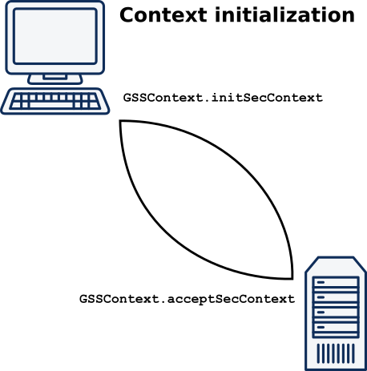
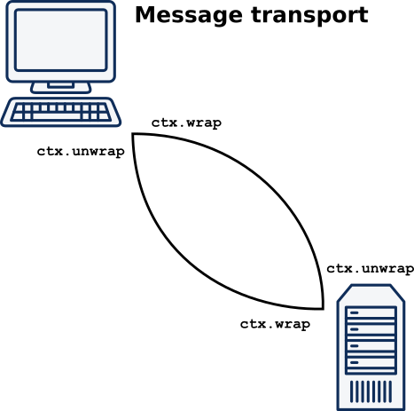

# Kerberos-аутентификация

— сетевой [протокол аутентификации][01], разработанный в MIT в
конце 80-х и позволяющий передавать
данные через незащищенные сети для безопасной идентификации.
Ориентирован в первую очередь на клиент-серверную модель и обеспечивает
взаимную аутентификацию — оба пользователя через сервер подтверждают
личности друг друга.

В первую очередь является протоколом, а не конкретной системой
аутентификации. Его реализации используются в различных ОС, в т.ч. и в
Windows, как метод аутентификации пользователей в домене.

Kerberos предоставляет как сетевую **аутентификацию**, так и безопасный
метод, посредством которого может быть проведена **авторизация** без
необходимости повторного ввода пароля или предоставления других
**удостоверяющих данных**. Поэтому он используется для обеспечения того,
что обычно называется **Технологией единого входа (Single Sign-on, SSO)**.

Kerberos не делает никаких предположений о защищённости той сети, поверх
которой он работает (по факту, он просто ей не доверяет). Однако, он
предполагает, что хосты приложений и особенно хост, на котором работает
Центр распределения ключей, являются защищёнными.

## Основные роли Kerberos

- Client
- Server/Service
- Центр распределения ключей (KDC, Key Distribution Center) —
  доверенный посредник между Клиентом и Сервером

## Особенности Kerberos:

1. Пароли или иные удостоверяющие данные **никогда не пересылаются по сети
   **.
   Подразумевается, что сетевой трафик может быть прослушан, может
   произойти подмена сообщения или другая атака. Вместо них
   используются билеты (Tickets).
2. Выдвигается обязательное требование, что информация о
   паролях/удостоверяющих данных хранится в единственном защищённом
   месте (Центре распределения ключей Kerberos). Поэтому удостоверяющие
   данные никогда не сохраняются на том хосте, который пользователь
   использует для входа/логина. После того, как произошёл первоначальный
   обмен в рамках **аутентификации**, этот хост должен забыть сведения о
   пароле.
3. Хосты/серверы приложений должны быть в состоянии подтвердить свою
   идентификационную сущность любому, кто запрашивает подобные
   доказательства.
4. Все коммуникации между аутентифицированными пользователями (клиентами) и
   сервисами приложений должны иметь возможность быть зашифрованными. С
   этой целью поддерживаются и могут применяться различные алгоритмы
   шифрования (все **симметричные**).
5. Поддерживает делегирование учетных данных (т.н. олицетворение)
6. Серверу не нужно общаться с KDC для аутентификации клиентов

## Узкие места Kerberos

- Время на всех 3 ролях должно быть синхронизировано, это необходимо для
  корректной работы Kerberos.
- KDC — это единая точка отказа всей системы.
- Клиенты Kerberos ищут свои сервера по доменным именам, поэтому необходимо
  настроить DNS и убедиться, что имена серверов успешно разрешаются, т.к.
  обработка имен хостов службы подвержена ошибкам

## Основные термины

### Аутентификация (authentication)

— процесс или процедуры, используемые для проверки того, что данные или
информация, заявленные как поступившие из какого-то источника (от какого-то
человека), могли поступить только из этого источника (от этого человека).
Не следует путать с авторизацией.

### Авторизация (authorization)

— после того, как пользователи прошли аутентификацию, они могут быть
авторизованы на получение или запрет доступа к определённым
системным/сетевым ресурсам, таким как файлы, приложения, либо возможность
отправки электронной почты, выхода в Интернет и т.п. Процесс аутентификации
обычно обеспечивает доступ к набору записей в базе данных по защите
информации, которые содержат данные по доступу и/или дополнительные данные,
основанные на принадлежности учётной записи к одной или нескольким группам.

Термин "**привилегия**" иногда используется как синоним авторизации. Так,
пользователь может иметь достаточно привилегий для доступа к ресурсу X, но
не к ресурсу Y, или, иными словами, он авторизован на доступ к X, но не
авторизован на доступ к Y.

### Удостоверяющие данные (Credentials)

— пароль и иные формы, такие как аппаратный токен или биометрические
данные). Удостоверяющие данные являются одним из способов доказать, что
Вы именно тот, за кого себя выдаёте. Так как Вы должны быть
единственным человеком (или, в некоторых случаях, группой лиц)
кто знает или имеет доступ к Вашим удостоверяющим данным, то когда Вы
предоставляете их в системе или в сети и они совпадают с теми, которые
ранее были безопасным способом занесены и сохранены в некоторую форму базы
данных по защите информации, это доказывает, что Вы именно тот, за кого
себя выдаёте. После выполнения неких форм обмена данными, которые будут
включать в себя предоставление Ваших удостоверяющих данных (например, набор
пароля), Вы становитесь **аутентифицированы**. Как правило, после
аутентификации Вам ещё нужно быть **авторизованным** для доступа к ресурсам
или информации.

### Симметричные алгоритмы шифрования

— также известные как системы с одним ключом (single-key) или с общим
секретом (shared-secret) или системы с закрытым ключом (private-key).
Используют единственный ключ (или набор ключей) как для шифрования так
и для расшифровывания данных. Один из участников использует его для
шифрования данных, а другой с помощью этого ключа извлекает их.

Единственный ключ (общий секрет) должен быть безопасным образом
распространён между сторонами, которые будут его использовать, перед
началом самих безопасных коммуникаций.

У систем с общим секретом существует как минимум два узких места:

- Во-первых, ключ должен быть распространён безопасным способом с помощью
  процесса, называемого управлением ключами, который сам по себе
  нетривиален.
- Во-вторых, ответственность за безопасность уже распространённого ключа
  лежит на всех сторонах коммуникации: "Самому себе я доверяю, но могу ли я
  доверять всем остальным сторонам, что они не допустили огласки ключа?".

Если ключ, являющийся общим секретом, скомпрометирован на любой из сторон,
то он скомпрометирован для всех использующих его сторон. Симметричные
алгоритмы используют значительно меньше вычислительных ресурсов, нежели их
асимметричные коллеги. Как правило, они являются единственным приемлемым
способом шифрования объемных потоков данных.


Примеры распространённых симметричных алгоритмов шифрования:

- DES (Data Encryption Standard, он же Data Encryption Algorithm (DEA))
- Triple DES (TDES, он же TDEA (Triple DEA))
- AES (Advanced Encryption Standard)
- IDEA (International Data Encryption Algorithm)
- RC4 (Rivest Cipher 4)

Типичные размеры ключей:

- 64 бита
- 128 бит
- 192 бита
- 256 бит

### Центр распределения ключей (KDC, Key Distribution Center)

При использовании Kerberos пользователи никогда не аутентифицируют себя
**напрямую** в различных необходимых им службах. Вместо этого KDC
функционирует как **доверенная сторонняя служба проверки подлинности**.
<br>Компонентами KDC являются:

- сервер аутентификации (AS, Authentication Server);
- служба выдачи разрешений (TGS, Ticket-Granting Service);

Функции службы KDC ограничиваются генерацией мандата. Ей больше не нужно
следить за тем, все ли отправленные сообщения доставлены соответствующим
адресатам. Даже если какое-нибудь из них попадет не туда, — ничего
страшного не случится. Расшифровать клиентскую копию сеансового ключа может
только тот, кто знает секретный долговременный ключ данного клиента, а
чтобы прочесть содержимое сеансового мандата, нужен секретный код сервера.

### Разрешение (Ticket)

— частично зашифрованная структура данных, содержимое которой известно
только издателю этого разрешения, и какой-либо стороне или сторонам, **к
которым это разрешение имеет отношение**.

В открытом виде разрешение содержит:

- Domain Name (Realm) — наименование области действия
- Service Principal Name (SPN) — имя **принципала сервиса**

В зашифрованном виде разрешение содержит:

- User Principal Name (UPN) — имя **принципала пользователя**
- Copy of the Session Key — случайным образом сгенерированный
  уникальный ключ сессии;
- Time To Live (TTL) — времени жизни ключа (по умолчанию - 10 часов)
- флаги и дополнительная информация

Промежуточные хосты, такие как клиентский хост, рассматривают эти
разрешения как **неразбираемый набор бит** и просто передают их на конечный
пункт назначения.

В Kerberos разрешения могут быть 2 видов:

- **мандат ST** (сеансовый мандат, сервисное разрешение) (Service Tickets,
  ST) — выдаётся службой выдачи разрешений (Ticket Granting Service, TGS).
- **мандат TGT** (Ticket Granting Tickets, TGT) — выдаётся сервером
  аутентификации.

### Сервисное разрешение или сеансовый мандат (Service Tickets, ST)

— позволяет пользователю получить доступ к требуемому Сервису приложений
(Application Service). ST также называют сервисным билетом (сеансовым
мандатом), который используется для получения доступа к требуемым
доменным ресурсам. По умолчанию действителен в течение 10 часов, не
может быть обновлен, а должен каждый раз запрашиваться повторно, в
отличие от TGT.

Одно из достоинств применения сеансовых мандатов состоит в том, что серверу
**не нужно хранить сеансовые ключи для связи с клиентами**. Они сохраняются
в кэш-памяти удостоверений (credentials cache) клиента, который направляет
мандат на сервер каждый раз, когда хочет связаться с ним. Сервер, со своей
стороны, получив от клиента мандат, дешифрует его и извлекает сеансовый
ключ. Когда надобность в этом ключе исчезает, сервер может просто стереть
его из своей памяти.

Такой метод дает и еще одно преимущество: у клиента исчезает необходимость
обращаться к центру KDC перед каждым сеансом связи с конкретным сервером.
**Сеансовые мандаты можно использовать многократно**. На случай же их
хищения устанавливается **срок годности мандата**, который KDC
указывает в самой структуре данных. Это время определяется политикой
Kerberos для конкретной области. Обычно срок годности мандатов не
превышает восьми часов, то есть, стандартной продолжительности одного
сеанса работы в сети. Когда пользователь отключается от нее, кэш-память
удостоверений обнуляется и все сеансовые мандаты вместе с сеансовыми
ключами уничтожаются.

### Сервис выдачи мандатов (TGS, Ticket-Granting Service)

Действует как контрольная точка и выдает сервисные мандаты после
аутентификации клиента.

### Разрешение на получение разрешения или мандат на выдачу мандатов (TGT мандат, Ticket-Granting Ticket)

Долговременный ключ пользователя генерируется на основе его пароля.
Когда Клиент проходит регистрацию, его пароль пропускается через
функцию одностороннего хеширования, в результате чего генерируется
криптографический ключ.

В центре KDC долговременные ключи Клиента хранятся в базе данных с
учетными записями пользователей. Получив запрос от Клиента, KDC
обращается в свою базу данных, находит в ней учетную запись нужного
пользователя и извлекает из соответствующего ее поля долговременный ключ.

Такой процесс — вычисление одной копии ключа по паролю и извлечение другой
его копии из базы данных — выполняется всего лишь один раз за сеанс, когда
пользователь входит в сеть впервые. Сразу же после получения
пользовательского пароля и вычисления долговременного ключа клиент Kerberos
рабочей станции запрашивает **специальный сеансовый мандат для KDC** и
сеансовый ключ, которые используются во всех последующих транзакциях с
KDC на протяжении текущего сеанса работы в сети.

На запрос пользователя KDC отвечает специальным сеансовым мандатом для
самого себя, так называемый мандат на выдачу мандатов (ticket-granting
ticket), или мандат TGT. Как и обычный сеансовый мандат, мандат TGT
содержит копию сеансового ключа для связи службы (в данном случае — центра
KDC) с клиентом.

В сообщение с мандатом TGT также включается копия сеансового ключа, с
помощью которой клиент может связаться с KDC. Мандат TGT шифруется
посредством долговременного ключа службы KDC, а клиентская копия сеансового
ключа — с помощью долговременного ключа пользователя.

Получив ответ службы KDC на свой первоначальный запрос, клиент дешифрует
свою копию сеансового ключа, используя для этого **копию долговременного
ключа пользователя** из своей кэш-памяти. После этого **долговременный
ключ,
полученный из пользовательского пароля**, можно удалить из памяти,
поскольку
он больше не понадобится: вся последующая связь с KDC будет шифроваться с
помощью **полученного сеансового ключа**. **Как и все другие сеансовые
ключи, он
имеет временный характер и действителен до истечения срока действия мандата
TGT, либо до выхода пользователя из системы**. По этой причине такой ключ
называют сеансовым ключом регистрации (logon session key).

С точки зрения клиента мандат TGT почти ничем не отличается от обычного
сервисного мандата.
Перед подключением к любой службе, клиент прежде всего обращается в
кэш-память удостоверений и достает оттуда **сеансовый мандат нужной службы
**.
Если его нет, он начинает искать в этой же кэш-памяти **мандат TGT**. Найдя
его, клиент извлекает оттуда же соответствующий сеансовый ключ регистрации
и готовит с его помощью **аутентификатор**, который вместе с мандатом TGT
высылает в центр KDC. Одновременно туда направляется **запрос на сеансовый
мандат для требуемой службы**. Другими словами, организация безопасного
доступа к KDC ничем не отличается от организации такого доступа к любой
другой службе домена — она требует **сеансового ключа**, 
**аутентификатора** и **мандата** (в данном случае мандата TGT).

По сути мандат TGT является доказательством успешно пройденной
аутентификации.
Когда пользователю требуется доступ к ресурсам, ему не нужно повторно
аутентифицироваться, клиент просто отправляет TGT, чтобы доказать, что
он уже недавно это сделал.

С точки же зрения службы KDC, мандаты TGT позволяют ускорить обработку
запросов на получением мандатов, сэкономив несколько наносекунд на
пересылке каждого из них. Центр распределения ключей KDC обращается к
**долговременному ключу пользователя только один раз**, когда предоставляет
клиенту **первоначальный мандат на выдачу мандата**. Во всех последующих
транзакциях с этим клиентом **центр KDC дешифрует мандаты TGT с помощью
собственного долговременного ключа** и извлекает из него **сеансовый ключ
регистрации**, который использует для проверки подлинности аутентификатора
клиента.

Все TGT мандаты KDC шифрует с помощью пароля для специальной учетной
записи `KRBTG`. Секретный ключ сервиса `KRBTGT` по умолчанию никогда не
меняется, только за исключением случаев, когда контроллер домена (DC) был
обновлён.

### Сеансовый ключ

— ключ, отправляемый KDC (Сервером аутентификации и Сервисом
выдачи мандатов) Клиенту. Шифруется с использованием хеша удостоверяющих
данных (например, пароля) Клиента или Сервиса.
Необходим для шифрования следующего сообщения Клиента к TGS или Серверу
Приложений.

### Клиент (client)

— некая сущность в сети (пользователь, хост или сервис), которая может
получить билет от Kerberos.

### Принципал (principal)

— это уникальная строка, полностью идентифицирующая пользователя службы
Kerberos, для которого разрешается аутентификация в Kerberos. Он
имеет форму `thing@REALM`.

Принципал может быть:

- именем сервиса, выполняющегося на хосте (мы будем называть его
  **принципалом сервиса** (**Service-Principal**))
- именем пользователя (мы будем называть его принципалом пользователя
  (**User-Principal**)).

Принципалы формируют индексное поле для информации об объекте,
хранящейся в базе данных безопасности Kerberos (в Центре распределения
ключей или KDC).

Форматы принципалов для **пользователей** и **сервисов** различаются:

- имя **принципала пользователя** — это приблизительный эквивалент имени
  пользователя или имени учётной записи.
  <br>Оно имеет форму `principal-name[/instance-name]@REALM` (где часть
  /instance-name является опциональной). Например, если имя пользователя в
  принципале пользователя — `alice`, а Realm — `joe`, то полный принципал
  будет `alice@joe`. Расширение `instance-name` позволяет любому
  пользователю иметь **более одного принципала**. Так, если `alice`
  является
  администратором области Realm `joe`, имя её принципала
  будет `alice/admin@joe`, и у этого принципала будут другие
  права (и удостоверяющие данные).

- если речь идёт о **принципале сервиса**, то форма имени принципала
  становится
  `service-name/QDN@REALM`, где
    - QDN — это доменное имя хоста (без точки в
      конце, как того требует FQDN), на котором работает сервис
    - service-name — это специфичная для приложения строка,
      идентифицирующая сервис на этом хосте. Некоторые типы сервисов
      используют ключевое слово host. Так, для сервиса ftp, работающего на
      хосте с именем fileserver.example.com в области Realm @EXAMPLE.COM,
      имя принципала сервиса
      будет `ftp/fileserver.example.com@EXAMPLE.COM`.

### Область действия (Realm)

— совокупность пользователей и серверов приложений, которые охватывает
(или имеет о них информацию) Центр распределения ключей (KDC). Так, для
того чтобы пользователь подсоединился (или вошёл) в Realm, у Сервера
аутентификации (Authentication Server) этой области Realm должны быть
сведения об **удостоверяющих данных** этого пользователя (и другая
информация о нём), хранящиеся в защищённой базе данных безопасности того
или иного вида (форма хранения не определяется в RFC).
<br>В терминологии Microsoft это будет называться Доменом (Domain).
Области Realm могут доверять другим Realm, в этом случае доверяющие
друг другу области должны быть **взаимно аутентифицированными**
(**Cross-Authenticated**).

Имя Realm **регистрозависимо**, обычно пишется в верхнем регистре
и совпадает с именем домена.
Форма имени — **...@REALM**. Например, если Realm называется JOE, то его
**Realm-имя** будет **@JOE** (что отличается от Realm-имени **@joe**), а
если Realm называется **EXAMPLE.COM**, то его Realm-имя будет
**@EXAMPLE.COM**.

(Примечание:
Согласно текущей рекомендации ([раздел 6.1 RFC 4120][02]) в качестве имени
REALM следует использовать доменное имя, которое часто преобразуется в
верхний регистр.)

Несмотря на то, что последняя форма может напоминать
адрес электронной почты, никакого отношения к электронной почте она не
имеет. Если буквы большие, это наверняка REALM, а не почта.

### Штамп времени до аутентификации (Pre-Authentication Timestamp)

— шифруется с помощью хеша, созданного на основе пароля от учетной
записи (`AS_req`) или с помощью сеансового ключа (`TSG_req`)

### Keytab (сокращение от "key table")

- бинарный файл таблицы ключей, содержащий пары "**принципал-зашифрованный
  долговременный ключ**" для одного или нескольких принципалов.
    - у секретных ключей есть 4 возможных типа шифрования. Эти ключи могут
      быть использованы повторно, так что их не придется повторно
      генерировать из пароля.
- в большинстве практических реализаций протокола Kerberos долговременные
  ключи генерируются на основе пароля пользователя, указываемого при входе
  в систему.
- может использоваться для идентификации в Kerberos без запроса пароля.
- чаще всего используются для того, чтобы серверные приложения могли
  принимать аутентификацию от клиентов (service.keytab)
- позволяют службам, работающим на хосте, аутентифицировать себя в центре
  распространения ключей (KDC).
- также можно использовать для получения исходных удостоверяющих данных для
  клиентских приложений (user1.keytab, user2.keytab ...)
- Файл keytab - независимый, и его можно передавать с одного компьютера
  на другой
- не имеет срока действия. Становится недопустимым только если субъект
  блокируется или меняется его пароль.
- TGT и ST, в отличие от keytab, устаревают, поэтому следует регулярно
  выполнять команду `kinit -k` для их обновления
- Так как в файле keytab содержатся **зашифрованные пароли**, он довольно
  важен. Любой пользователь с правами чтения keytab может запустить команду
  в области Kerberos от имени субъекта, содержащегося в файле.
  Следовательно, очень важно ограничить права доступа к этому файлу и
  тщательно их отслеживать, чтобы читать его могли только субъекты, которые
  идентифицируются в приложении.
- Файл keytab следует создавать еще до использования. Это можно сделать
  несколькими способами:
    - с помощью JRE утилиты диспетчера таблицы ключей Kerberos - ktab
        - `ktab -k jduke.keytab -a jduke@TEST.REALM theduke`
    - в UNIX с помощью команды ktutil, которая позволяет создавать файлы
      keytab и управлять ими.
- для просмотра содержимого файла keytab можно воспользоваться
  следующими способами:
    - с помощью JRE утилиты диспетчера таблицы ключей Kerberos - ktab
        - `ktab -k jduke.keytab -l -e -t`

      |KVNO|Timestamp|                        Principal                        |
                                                                                                                                                                                          |---:|:-------------------------------------------------------:|:-------:|
      |1|09.03.23 15:21| jduke@TEST.REALM (18:AES256 CTS mode with HMAC SHA1-96) |
      |1|09.03.23 15:21| jduke@TEST.REALM (17:AES128 CTS mode with HMAC SHA1-96) |
- таким образом, keytab состоит из следующих элементов:
    - kvno - key version number - номер версии ключа
    - timestamp - метка, указывающая, когда запись была записана в таблицу
      ключей
    - principal name — имя принципала (пользователя или сервиса)
    - тип шифрования
    - сам ключ шифрования
- "**keytab по умолчанию**" используется серверными приложениями, если
  приложение не запрашивает конкретную keytab. Наименование keytab по
  умолчанию задается следующими значениями в порядке убывания
  приоритета:
    - в переменной окружения `KRB5_KTNAME`
    - в переменной профиля `default_keytab_name` в `[libdefaults]`
    - в жестко заданном значении переменной `DEFKTNAME`
- "**client keytab по умолчанию**" используется, если присутствует и
  доступен на чтение для автоматического получения исходных
  удостоверяющих данных для клиентских приложений GSSAPI. Основное имя
  первой записи в keytab используется по умолчанию при получении
  исходных удостоверяющих данных. Имя client keytab по умолчанию
  задается следующими значениями в порядке убывания приоритета:
    - в переменной окружения `KRB5_CLIENT_KTNAME`
    - в переменной профиля `default_client_keytab_name` в `[libdefaults]`
    - в жестко заданном значении переменной `DEFCKTNAME`

----

## Схема общения между Клиентом и Сервером

представляется в виде потока сообщений:


1. Клиент аутентифицируется в KDC и в случае успеха получает TGT.
    1. Пользователь выполняет вход в систему на клиентском хосте (1),
       предоставляя при этом **принципал пользователя** и требуемый
       **принципал сервиса**, которые посылаются в виде `AS_REQ` (
       Authentication Service Request) (7) Серверу аутентификации (
       Authentication Server, AS) (2) Центра распределения ключей (KDC)
       Kerberos (5) открытым текстом (без какого-либо шифрования).
       <br>В качестве KDC в инфраструктуре MS Active Directory
       выступают контроллеры доменов.

       

       <br>`AS_REQ` содержит следующие данные:
        - в открытом виде:
            - User Principal Name (UPN) — имя **принципала пользователя**
            - Service Principal Name (SPN) — имя **принципала сервиса**,
              к которому пользователь хочет подключиться (как правило,
              принципала Службы выдачи разрешений (TGS), имеющего название
              `krbtgt/REALM@REALM`)
            - (опционально) список IP-адресов, которые пользователь хочет
              использовать
            - (опционально) время жизни для этого входа в систему
        - Pre-Authentication Timestamp, зашифрованный с использованием
          удостоверяющих данных (хеша) **принципала пользователя**

    2. После проверки наличия **принципала пользователя** и **принципала
       сервиса** в базе данных безопасности `NTDS.dit`(6) и сравнения
       временных меток Сервер аутентификации (2)
       посылает Клиенту ответное сообщение `AS_REP` (Authentication
       Service Reply) (8).

       <br>Если зашифрованный Клиентом штамп времени отличается от
       текущего в момент расшифровки **более, чем на 5 минут** (значение
       параметра `Time Skew` по умолчанию), то будет отправлен
       ответ `PreAuth failed`. При легитимной ситуации набор атрибутов
       может быть расшифрован только на контроллере домена.

       <br>При получении этого сообщения, клиент (1) запрашивает
       **удостоверяющие данные пользователя**, и, если он сможет
       расшифровать сообщение (8) с
       помощью представленных удостоверяющих данных, то эти удостоверяющие
       данные считаются корректными и пользователь становится
       **аутентифицированным**. После этого сведения об удостоверяющих
       данных пользователя могут быть сразу же забыты. Хотя системы,
       проводящие аутентификацию, могут запросить ввести удостоверяющие
       данные в тоже самое время, когда вводится имя учётной записи
       пользователя, на самом деле это не требуется, поскольку протокол
       Kerberos позволяет отложить запрос удостоверяющих данных вплоть до
       этого шага, чтобы минимизировать возможные негативные последствия
       при использовании небезопасной хост-системы или ПЭВМ.

        

       <br>`AS_REP` содержит 2 следующих зашифрованных пакета данных:

        - пакет, предназначенный для клиента и зашифрованный с
          использованием удостоверяющих данных (хеша)
          **принципала пользователя** (**эти данные знают обе стороны**)
          , и включающий в себя:
            - случайным образом сгенерированную копию уникального
              сеансового ключа (Copy of the Session Key);
            - время жизни этого ключа (Time To Live (TTL) — обычно
              короткое;
            - отметка времени timestamp;
            - копия метки nonce, полученной от клиента (1).
        - пакет, предназначенный для для Службы выдачи разрешений,
          зашифрованный с использованием ключа сервиса (системной
          учетной записи `KRBTGT` Службы выдачи разрешений), запрашиваемый
          клиентом **билет TGT (разрешение на получение разрешения)**.
          С точки зрения клиента представляет собой **неразбираемый
          набор бит**, который просто передаётся TGS (3) при запросе
          доступа к конкретному Сервису приложений (4).
          Клиент не может интерпретировать содержимое TGT,
          поскольку у него нет (да ему и не надо) ключа сервиса, с помощью
          которого его можно было бы расшифровать.

2. Клиент запрашивает у KDC сервисное разрешение TGS для Сервера
   приложений
    1. Когда **аутентифицированный** пользователь захочет получить доступ к
       сервису, клиент (1) посылает **зашифрованное** сообщение (9) в виде
       запроса `TGS_REQ` Службе выдачи разрешений (Ticket Granting Service,
       TGS) (3) в составе KDC (5).
       В этом сообщении содержится:
        - разрешение TGT (полученное в сообщении `AS_REP` (8)),
          подтверждающее личность пользователя;
        - структура под названием **Authenticator** (содержащая в
          частности имя требуемого **принципала сервиса**, т.е. имя службы,
          для которой Клиент запрашивает доступ), подтверждающая, что
          пользователь **знает** сеансовый ключ, являющийся частью TGT
          ключа.

       

       <br>Таким образом, в самом `TGS_REQ` фигурируют атрибуты:
        - Ticket-Granting Ticket (TGT) (**неразбираемый набор бит** с
          точки зрения клиента), зашифрованный ключом TGS
        - Структура **Authenticator**, шифруемая с использованием
          сеансового ключа, полученного во время последовательности
          обмена сообщений 1-го этапа и в основном включает:
            - User Principal Name — имя **принципала пользователя**
            - Service Principal Name — имя требуемого  **принципала
              сервиса**
            - Domain Name (Realm)
            - метка nonce (случайное число)
            - Pre-Authentication Timestamp
        - Опционально, вместе с **Authenticator** клиент может
          предложить "подключ" (по существу, замену сеансового ключа). При
          наличии этого "подключа", TGS (3) должен использовать его для
          шифрования ответа.

    2. TGS (3) проверяет SPN и срок действия билета TGT, расшифровывает и
       анализирует штамп времени.
       <br>Если SPN указан верно, срок действия билета TGT не истек, и
       штамп времени находится в допустимом диапазоне, то
       TGS (3) отправляет ответ (10) в виде сообщения `TGS_REP` (Ticket
       Granting Service Reply) с сервисным разрешением (ST), разрешающим
       использование запрашиваемого сервиса. Это сервисное
       разрешение интерпретируется клиентом как **неразбираемый набор бит**
       и зашифровано с использованием **хеша пароля учетной записи, от
       имени которой запущен сервис**.

       

       <br>В самом `TGS_REP` фигурируют атрибуты:
        - Зашифрованные либо с использованием сеансового ключа,
          полученного во время последовательности обмена сообщений
          этапа аутентификации, либо с использованием подключа (замены
          сеансового ключа), предложенного клиентом в сообщении `TGS_REQ`:
            - случайным образом сгенерированный **сеансовый ключ Сервиса
              приложений** (который будет использоваться для шифрования
              последующих сообщений между клиентом (1) и Сервером
              приложений (4));
            - время жизни этого ключа;
            - отметка времени timestamp;
            - принципал сервиса, который был запрошен
            - копия метки nonce (случайное число), отправленной клиентом (
              1).
        - Сервисное разрешение или сеансовый мандат (ST), зашифрованный с
          помощью долговременного ключа, который знают только служба KDC и
          сервер, на котором выполняется запрашиваемый клиентом
          сервис. Это разрешение содержит множество информации, интересной
          Сервису приложений. С точки зрения клиента, ST представляет собой
          **неразбираемый набор бит**, который передаётся Серверу
          приложений, когда тот требует подтвердить свои права. Клиент не
          может
          интерпретировать содержимое ST, поскольку у него нет (да ему и не
          нужно) каких-либо ключей, которыми он мог бы его расшифровать.
          Важная часть содержимого ST — **копия ключа сессии сервиса**
          приложений, сгенерированного TGS и также отправленного клиенту.
          <br>Примечание: Серверы приложений также проходят
          аутентификацию в KDC (5), используя процедуру, практически
          аналогичную описанной выше для аутентификации пользователя.

       <br>Клиент (1) расшифровывает свою часть структуры с помощью либо
       ключа сессии, либо предложенного им подключа, достаёт из неё
       свою копию сеансового ключа, которую помещает в безопасное
       хранилище (оно располагается не на диске, а в оперативной памяти).
       Он также извлекает сеансовый мандат (ST).

       <br>**Вся ответственность за обработку мандата, несущего в себе
       шифрованный сеансовый ключ, возлагается на клиента, который должен
       доставить его на сервер**.

3. Клиент аутентифицируется на Сервере приложений, предъявляя
   действительный сервисный мандат (сервисное разрешение) ST.
    1. Клиент (1) посылает (11) сообщение `AP_REQ` соответствующему
       Серверу приложений (Application Server) (4).
       <br>В этом сообщении содержится:
        - Сервисное разрешение (ST), зашифрованное с применением
          долговременного ключа этого сервера и полученное в предыдущем
          ответе от TGS (10), подтверждающее личность пользователя;
        - Структура **Authenticator** пользователя, как определено выше для
          сообщения `TGS_REQ`. Эта структура **Authenticator** зашифрована
          с помощью сеансового ключа Сервиса приложений, полученного из
          предыдущего сообщения `TGS_REP` (10), и который валиден в течение
          5 минут.

       Этот мандат в комбинации с аутентификатором как раз и составляет
       удостоверение, по которому сервер определяет "личность" клиента.

       <br>Клиент может запросить (с помощью флаг-поля в этом сообщении),
       что ему требуется провести **взаимную аутентификацию**. В этом
       случае Сервер приложений (4) ответит сообщением `AP_REP`,
       содержащим запрашиваемую информацию. Если взаимная аутентификация
       не запрашивается, то целевой сервис сразу же считается доступным,
       и в некоторых реализациях в этом же сообщении могут быть посланы
       данные, специфичные для целевого приложения.

              Клиент -> Серверу Приложений:
              Привет, Сервер, это Я, Клиент. У меня есть сервисное 
              разрешение ST и я знаю наш сеансовый ключ. Поговори со мной!

    2. Сервер, получив "удостоверение личности" клиента, прежде всего с
       помощью своего секретного ключа расшифровывает сеансовый мандат и
       извлекает из него сеансовый ключ, который затем использует для
       дешифрования аутентификатора клиента. Если все проходит нормально,
       делается заключение, что удостоверение клиента выдано доверенным
       посредником, то есть, службой KDC. Клиент может потребовать у
       сервера проведения взаимной аутентификации. В этом случае сервер с
       помощью своей копии сеансового ключа шифрует метку времени из
       аутентификатора клиента и в таком виде пересылает ее клиенту в
       качестве собственного аутентификатора.

           Сервер Приложений -> Клиенту:
           Дай проверить. Конечно. Я смог расшифровать разрешение ST и 
           убедился в том в том, что ты знаешь сеансовый ключ. Теперь я 
           тоже знаю сеансовый ключ и ты тоже можешь его проверить, если 
           хочешь.

----

## Сравнение TLS и Kerberos (Java Secure Socket Extension (JSSE) vs Java GSS-API)

Общее:

- Клиент-серверная аутентификация
    - TLS по умолчанию аутентифицирует сервер
    - Kerberos по умолчанию аутентифицирует клиента
- шифрование и целостность данных
- структуры данных описаны в ASN.1

Kerberos:

- Единая точка входа
- делегирование удостоверяющих данных: сервер выдает себя за клиента
  при доступе к другим службам
- связь на основе токенов: выборочное шифрование
- Transport: UDP, TCP

TLS:

- шифрование с открытым ключом
- API на основе сокетов
- аутентификация не зависит от доступности центрального сервера
- не имеет строгих требований ко времени (синхронизация часов)
- Transport: TCP

---

# Kerberos Tools

Unix/Linux:

- kinit
- klist
- kdestroy
- kutil
- kvno
- kadmin

Windows:

- klist
- ktpass
- ksetup
- модуль Active Directory в PowerShell, заменяющий отчасти kinit в unix

Java runtime in Windows (Java SDK bin):

- [kinit](https://docs.oracle.com/javase/8/docs/technotes/tools/windows/kinit.html)
    - используется для получения и кеширования TGT билетов Kerberos.
      Этот инструмент аналогичен по функциональности инструменту kinit,
      который обычно встречается в других реализациях Kerberos, таких как
      SEAM и MIT Reference.
    - Пользователь должен быть зарегистрирован в качестве принципала в
      KDC перед запуском kinit.
- [klist](https://docs.oracle.com/javase/8/docs/technotes/tools/windows/klist.html)
    - отображает записи в локальном кэше удостоверяющих данных и
      таблице ключей (key table)
    - после изменения кэша удостоверяющих данных с помощью инструмента
      kinit или
      изменения таблицы ключей с помощью инструмента ktab единственный
      способ проверить изменения — просмотреть содержимое кэша учетных
      данных или таблицы ключей с помощью инструмента klist
    - не изменяет базу данных Kerberos
- [ktab](https://docs.oracle.com/javase/8/docs/technotes/tools/windows/ktab.html)
    - позволяет пользователю управлять именами принципалов и сервисными
      ключами, хранящимися в локальной таблице ключей.
    - перед настройкой сервера для использования Kerberos необходимо
      настроить keytab на хосте, на котором работает сервер
    - любые обновления, внесенные в keytab с помощью инструмента ktab, не
      влияют на базу данных Kerberos. Если вы меняете ключи в keytab, вы
      также должны внести соответствующие изменения в базу данных Kerberos.

Tools for Debugging:

- network analyzer: WireShark / tcpdump
- ASN.1 parser:
    - dumpasn1 tool
    - org.apache.kerby.asn1.Asn1
- system properties
    - sun.security.krb5.debug=true
    - sun.security.jgss.debug=true
    - sun.security.spnego.debug=true
    - com.ibm.security.krb5.Krb5Debug=all
    - com.ibm.security.jgss.debug=all
    - java.security.debug=gssloginconfig
- Krb5LoginModule option debug=true

---

## Kerberos Servers

- MIT Kerberos
- MS Active Directory
- Heimdal

## Файлы настроек Kerberos

- На сервере

      /etc/krb5kdc/kdc.conf # настройки KDC
      /etc/krb5.conf        # настройки сервера аутентификации 
                            # (описание realms, доменных имен и других настроек)

- На клиенте

      /etc/krb5.conf          # настройки сервера аутентификации 
                              # (описание realms, доменных имен и других настроек)

  Содержимое файла /etc/krb5.conf в Linux:

    ```
    [libdefaults]
        kdc_realm = TEST.REALM
        default_realm = TEST.REALM
        udp_preference_limit = 1
        kdc_tcp_port = 10088
        #_KDC_UDP_PORT_
    
    [realms]
        TEST.REALM = {
            kdc = localhost:10088
        }
    ```

-----

## Java KDC реализации

2 реализации в Apache Directory Project

- Apache Kerby — новый проект (первая реализация в 2017 году)
- ApacheDS (Directory Service) — старый проект. разработка ведется
  медленно

### Apache Kerby

Maven dependencies:

```
<dependency>
  <groupId>org.apache.kerby</groupId>
  <artifactId>kerb-simplekdc</artifactId>
  <version>2.0.3</version>
  <scope>test</scope>
</dependency>
```

Запуск сервера KDC:

```java
SimpleKdcServer kdc=new SimpleKdcServer();
    kdc.setKdcHost("localhost");
    kdc.setKdcRealm("TEST.REALM");
    kdc.setKdcPort(10088);
    /* SimpleKdcServer init also creates krb5.conf file 
       and initializes Kadmin API. */
    kdc.init();

    kdc.createPrincipal("jduke","theduke");
    kdc.start();
```

После запуска экземпляра Apache Kerby получаем:

- интерфейс администрирования;
- инструменты для создания keytabs;
- легкую настройку и запуск встроенного KDC.

Проверка порта

- в windows:
  `netstat -aon | find "10088"`
- в unix:
  `netstat -aon | grep "10088"`

### ApacheDS

Maven dependencies:

```
<dependency>
  <groupId>org.apache.directory.server</groupId>
  <artifactId>apacheds-all</artifactId>
  <version>2.0.0.AM26</version>
  <scope>test</scope>
</dependency>
```

Запуск реализации KDC:

```java
@CreateDS(name = "HazelcastDS",
    partitions = {
        // @CreatePartition ...
    },
    additionalInterceptors = {KeyDerivationInterceptor.class})
@CreateKdcServer(primaryRealm = "HAZELCAST.ORG",
    kdcPrincipal = "krbtgt/HAZELCAST.ORG@HAZELCAST.ORG",
    searchBaseDn = "dc=hazelcast,dc=org")
public static void startKdc()throws Exception{
    DirectoryService directoryService=DSAnnotationProcessor.getDirectoryService();
    KdcServer kdc=ServerAnnotationProcessor.getKdcServer(directoryService,10088);
    }
```

---

## Kerberos в Java на платформе Windows

- можно повторно использовать аутентификацию в домене Active Directory:
    - разрешить доступ к сеансовому ключу в Local Security Authority (LSA)
      ```
      Reg Add 
      HKEY_LOCAL_MACHINE\System\CurrentControlSet\Control\Lsa\Kerberos\Parameters
      /v AllowTGTSessionKey /t REG_DWORD /d 1
      ```
    - обходной путь PowerShell для отсутствующего нативного kinit
      ```
      Import-Module ActiveDirectory
      ```
- можно создать playground из простого [шаблона][09] на MS Azure

---

## Java Authentication and Authorization Service (JAAS)

Позволяет аутентифицировать пользователей и безопасно определять, кто
в данный момент выполняет код Java, а также авторизовывать пользователей,
чтобы убедиться, что у них есть права управления доступом, или
разрешения, необходимые для выполнения выполняемых действий.

JAAS может быть использован для двух целей:

- для аутентификации пользователей, чтобы надежно и безопасно определить,
  кто в данный момент выполняет код Java, независимо от того, работает ли
  этот код как приложение, апплет, компонент или сервлет;
- для авторизации пользователей, чтобы убедиться, что у них есть права
  управления доступом (разрешения), необходимые для выполнения выполняемых
  действий

---

## JAAS аутентификация в KDC с помощью Krb5LoginModule

- vendor specific implementation classes of login module
    - Oracle: [com.sun.security.auth.module.Krb5LoginModule] [04]
    - IBM:   [com.ibm.security.auth.module.Krb5LoginModule] [05]
- [JAAS Login Configuration File] [06] (jaas.conf)
    ```
    KerberosLogin {
    com.sun.security.auth.module.Krb5LoginModule required
    debug=true;
    };
    ```
- используем JAAS API для создания контекста логина и получения TGT
  разрешения
    ```java
    LoginContext lc = new LoginContext("KerberosLogin",
            new NamePasswordCbHandler("jduke@TEST.REALM", "theduke".toCharArray()));
    lc.login();
    Subject subj = lc.getSubject();  // получаем TGT разрешение
    ```

## Системные свойства (System properties) для аутентификации Kerberos

- java.security.krb5.conf — путь к krb5.conf файлу.
- java.security.krb5.realm — дефолтная область
- java.security.krb5.kdc — дефолтный хост KDC (не поддерживает кастомные
  порты)
- sun.security.krb5.debug=true — отладочный вывод (Oracle)
- com.ibm.security.krb5.Krb5Debug=all — отладочный вывод (IBM)

# Kerberos APIs

- GSS-API [(RFC 4121)] [11]
- SPNEGO API [(RFC 4178)][10]

## GSS-API [(RFC 2743)][08]

- Generic Security Service Application Program Interface (Универсальный
  программный интерфейс службы безопасности)
- фреймворк, обеспечивает единый доступ к службам безопасности
- сам по себе не обеспечивает безопасности, делегирует базовый механизм
  безопасности, чем похож, например, на TLS, где необходимо указывать
  cipher suite

## GSS-API с точки зрения Kerberos [(RFC 4121)] [11]

- Kerberos является преобладающим механизмом для GSS-API
- GSS-API предоставляет стандартизированный безопасный API для Kerberos.

в GSS-API есть две фазы:

1. Инициализация контекста

   

   acceptSecContext — некий токен в виде массива байт, возвращаемый
   отправителю

2. Передача сообщений:

   

   в данной фазе происходит обмен токенами и их распаковка/запаковка.

## GSS-API с точки зрения Java [(RFC 2853)][07]

- package org.ietf.jgss, содержит следующие основные классы:
    - GSSManager — точка входа, является фабрикой других классов
    - GSSContext — security context, содержащий состояние
    - GSSName — содержит имена принципалов
    - GSSCredential — содержит удостоверяющие данные принципалов
    - MessageProp — позволяет задавать некоторые свойства сообщений
      (например, шифрование)
    - Oid
- **извлекает** удостоверяющие данные Kerberos из субъекта JAAS
- также может самостоятельно пройти аутентификацию JAAS. Для этого
  требуется определить некоторую конфигурацию
    - записи конфигурации входа (login config entries):
        - com.sun.security.jgss.krb5.initiate
        - com.sun.security.jgss.krb5.accept
    - системное свойство (system property):
        - javax.security.auth.useSubjectCredsOnly=false

## GSS-API с точки зрения Postgres

Имя принципала, используемое конкретным установленным экземпляром Postgres,
не зашито в сервере ни в каком виде; оно задаётся в файле keytab,
прочитав который сервер определяет назначенный ему идентификатор. Если в
данном файле задано несколько принципалов, сервер выберет любой из них. В
качестве области сервера выбирается предпочитаемая область, заданная в
доступных серверу файлах конфигурации Kerberos.

## Kerberos в клиент-серверном приложении с поддержкой JAAS

Клиент:

- аутентификация в KDC через JAAS Krb5LoginModule
- запрашивает Сервисное разрешение (ST) путем инициализации GSSContext.
- initSecContext возвращает GSS-API токен, который включает Сервисное
  разрешение (ST)
- отправляет токен на сервер в качестве удостоверяющих данных

Сервер:

- использует Krb5LoginModule для загрузки keytab файла в Удостоверяющие
  данные Субъекта
- получает GSS-API токен от клиента
- использует кастомный модуль логина и пытается получить GSS-API токен
  в новом GSSContext

## SPNEGO API [(RFC 4178)][10]

- Simple and Protected GSSAPI Negotiation Mechanism (Простой и защищенный
  механизм согласования GSSAPI)
- псевдомеханизм - позволяет согласовать реальный механизм. Если клиент
  и сервер поддерживают множественный протокол безопасности
  (множественные механизмы безопасности), то чистый GSS-API не
  позволяет согласовать какой механизм будет использоваться. SPNEGO как
  бы говорит "я поддерживаю такой-то список механизмов"
- чаще всего используется в web приложениях.

[01]: https://www.rfc-editor.org/rfc/rfc4120

[02]: https://www.rfc-editor.org/rfc/rfc4120#section-6.1

[03]: https://web.mit.edu/kerberos/krb5-1.20/doc/index.html

[04]: https://docs.oracle.com/en/java/javase/11/docs/api/jdk.security.auth/com/sun/security/auth/module/Krb5LoginModule.html

[05]: https://www.ibm.com/docs/en/sdk-java-technology/8?topic=jgss-krb5loginmodule

[06]: https://docs.oracle.com/javase/8/docs/technotes/guides/security/jaas/JAASRefGuide.html#AppendixB

[07]: https://www.rfc-editor.org/rfc/rfc2853

[08]: https://www.rfc-editor.org/rfc/rfc2743

[09]: https://github.com/maxskunkworks/TLG/tree/master/tlg-base-config_3-vm

[10]: https://www.rfc-editor.org/rfc/rfc4178

[11]: https://www.rfc-editor.org/rfc/rfc4121.html